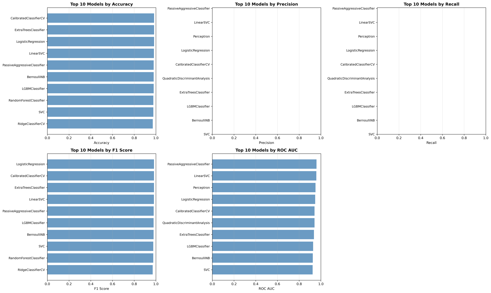

# SMS Spam Detection: Traditional ML vs LLM Embeddings

Educational project comparing traditional ML approaches with modern transformer-based embeddings for SMS spam classification.

## Project Overview

**Goal**: Compare two approaches to text classification:
1. **Traditional ML**: TF-IDF vectorization + classical algorithms
2. **LLM Embeddings**: Sentence transformers + modern classifiers

**Dataset**: SMS Spam Collection (5,571 messages)
- Ham: 4,825 (86.6%)
- Spam: 747 (13.4%)

## Traditional ML Performance



## Setup

```bash
# Create conda environment
conda env create -f ml.yml
conda activate sms_ml
```

## Usage

```bash
# 1. Generate embeddings and preprocess data
python embed.py

# 2. Run traditional ML approach
python traditional_ml.py

# 3. Run embedding-based approach (coming soon)
python embedding_classifier.py

# 4. Compare all models (coming soon)
python comparison.py
```

## DB Storage

ChromaDB is used as a fast, local storage solution for storing text embeddings for semantic search and classification. 