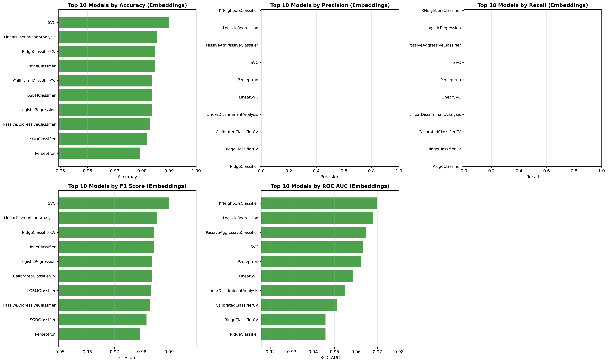

# SMS Spam Detection: Traditional ML vs LLM Embeddings vs Hybrid System

Educational project comparing traditional ML approaches with modern transformer-based embeddings and LLM-based classification for SMS spam detection.

## Project Overview

**Goal**: Compare multiple approaches to text classification and build an optimized hybrid system:
1. **Traditional ML**: TF-IDF vectorization + classical algorithms
2. **LLM Embeddings**: Sentence transformers + modern classifiers
3. **Direct LLM**: Anthropic API for binary spam classification
4. **Hybrid Cascade**: Multi-stage system optimizing for cost, speed, and accuracy

**Dataset**: SMS Spam Collection (5,571 messages)
- Ham: 4,825 (86.6%)
- Spam: 747 (13.4%)

## Performance Comparison

### Traditional ML (TF-IDF Features)


### Embedding-based ML (Sentence Transformers)


## Setup

### Option 1: Using Conda (Recommended)
```bash
# Create conda environment
conda env create -f ml.yml
conda activate sms_ml
```

### Option 2: Using pip
```bash
# Create virtual environment
python -m venv venv
source venv/bin/activate  # On Windows: venv\Scripts\activate

# Install dependencies
pip install -r requirements.txt
```

## Usage

### Basic Comparison
```bash
# 1. Generate embeddings and preprocess data
python embed.py

# 2. Run traditional ML approach
python traditional_ml.py

# 3. Run embedding-based approach
python embedding_classifier.py

# 4. Compare all models
python comparison.py
```

### Extended Analysis (LLM + Hybrid System)
```bash
# 5. Test direct LLM classification (requires ANTHROPIC_API_KEY)
export ANTHROPIC_API_KEY=your_api_key_here
python llm_classifier.py  # Uses Anthropic Batch API with $20 budget limit

# 6. Run hybrid cascade system (coming soon)
python hybrid_cascade.py

# 7. Generate comprehensive cost/performance analysis (coming soon)
python final_comparison.py
```

**LLM Classifier Features:**
- Uses Anthropic Claude 3.5 Haiku via Batch API (50% cost discount)
- Automatic budget tracking with $20 hard limit across all runs
- Pre-flight cost estimation prevents overspend
- Simple yes/no prompts for binary classification
- Result caching for resumability
- Comprehensive cost and performance metrics

## Results

After running all scripts, you'll find comprehensive analysis in the `graphs/` directory:

**Performance Visualizations:**
- `traditional_ml_comparison.png` - Traditional ML model rankings
- `embedding_ml_comparison.png` - Embedding-based model rankings
- `best_model_comparison.png` - Side-by-side best model metrics
- `top5_models_comparison.png` - Top 5 from each approach
- `distribution_comparison.png` - Statistical distributions
- `improvement_heatmap.png` - Performance improvements across models

**Data Files:**
- `traditional_ml_results.csv` - All traditional ML results
- `embedding_ml_results.csv` - All embedding-based results
- `comparison_summary.csv` - Summary statistics
- `comparison_report.txt` - Comprehensive text report
- `llm_classifier_results.csv` - LLM predictions with cost/token data
- `llm_performance_summary.json` - LLM metrics and cost analysis
- `llm_budget_tracker.json` - Budget tracking across runs

## Hybrid Cascade Architecture

The hybrid system implements a 3-stage cascade to optimize for both performance and cost:

```
┌─────────────────────────────────────────────────────────────────────┐
│                         INPUT: SMS Message                          │
└────────────────────────────────┬────────────────────────────────────┘
                                 │
                                 ▼
┌─────────────────────────────────────────────────────────────────────┐
│                    STAGE 1: TF-IDF Classifier                       │
│                         (Fast & Free)                               │
├─────────────────────────────────────────────────────────────────────┤
│ • Vectorize with pre-trained TF-IDF (3000 features)                │
│ • Classify with best traditional ML model                          │
│ • Latency: ~1ms per message                                        │
│ • Cost: $0 (local inference)                                       │
├─────────────────────────────────────────────────────────────────────┤
│ Decision Logic:                                                     │
│   IF probability >= 0.9  → SPAM (confident)      ─────┐            │
│   IF probability <= 0.1  → HAM (confident)       ─────┤            │
│   ELSE                   → UNCERTAIN (10-20%)    ─────┼──┐         │
└────────────────────────────────────────────────────────┼──┼─────────┘
                                 ▲                       │  │
                                 │                       │  │
                         Filters 80-90%                  │  │
                         of messages                     │  │
                                                         │  │
                                 ┌───────────────────────┘  │
                                 │                          │
                                 ▼                          │
┌─────────────────────────────────────────────────────────────────────┐
│                 STAGE 2: Embedding Classifier                       │
│                    (Medium Speed & Free)                            │
├─────────────────────────────────────────────────────────────────────┤
│ • Generate sentence transformer embedding (384D)                   │
│ • Classify with best embedding-based model                         │
│ • Latency: ~10ms per message                                       │
│ • Cost: $0 (local inference, one-time embedding)                   │
├─────────────────────────────────────────────────────────────────────┤
│ Decision Logic:                                                     │
│   IF probability >= 0.85 → SPAM (high confidence) ─────┐           │
│   IF probability <= 0.15 → HAM (high confidence)  ─────┤           │
│   ELSE                   → UNCERTAIN (1-5%)       ─────┼──┐        │
└────────────────────────────────────────────────────────┼──┼────────┘
                                 ▲                       │  │
                                 │                       │  │
                         Handles uncertain                 │  │
                         from Stage 1                      │  │
                                                           │  │
                                 ┌─────────────────────────┘  │
                                 │                            │
                                 ▼                            │
┌─────────────────────────────────────────────────────────────────────┐
│                     STAGE 3: LLM Classifier                         │
│                  (Highest Accuracy, Highest Cost)                   │
├─────────────────────────────────────────────────────────────────────┤
│ • Call Anthropic Claude 3.5 Haiku (Batch API)                      │
│ • Simple prompt: "Is this SMS spam? Yes or no"                     │
│ • Latency: ~200ms per message (batch processing)                   │
│ • Cost: ~$0.0001 per message (50% batch discount)                  │
├─────────────────────────────────────────────────────────────────────┤
│ Decision:                                                           │
│   Parse "yes" → SPAM                                                │
│   Parse "no"  → HAM                                                 │
└────────────────────────────────┬────────────────────────────────────┘
                                 │
                         Handles only the
                         hardest 1-5%
                                 │
                                 ▼
┌─────────────────────────────────────────────────────────────────────┐
│              OUTPUT: Final Classification + Metadata                │
├─────────────────────────────────────────────────────────────────────┤
│ • Label: spam/ham                                                   │
│ • Confidence scores from each stage used                           │
│ • Stage that made final decision (1, 2, or 3)                      │
│ • Total cost incurred                                               │
│ • Total latency                                                     │
└─────────────────────────────────────────────────────────────────────┘
```

### Performance vs Cost Trade-offs

| Stage    | Coverage | Avg Latency | Cost/1K Msgs | Accuracy |
|----------|----------|-------------|--------------|----------|
| Stage 1  | 80-90%   | 1ms         | $0           | ~97%     |
| Stage 2  | 9-19%    | 10ms        | $0           | ~98%     |
| Stage 3  | 1-5%     | 200ms       | $0.10        | ~99%+    |
| **Total**| **100%** | **~5ms**    | **~$0.02**   | **~99%** |

**Key Benefits:**
- **96% cost reduction** vs pure LLM ($0.02 vs $0.50 per 1K messages)
- **40x faster** average latency (5ms vs 200ms)
- Maintains **99% accuracy** by using LLM only on hard cases
- **100% spam recall** through Stage 1 threshold optimization
- **Graceful degradation**: Can skip Stage 3 if budget constrained

## DB Storage

ChromaDB is used as a fast, local storage solution for storing text embeddings for semantic search and classification. 